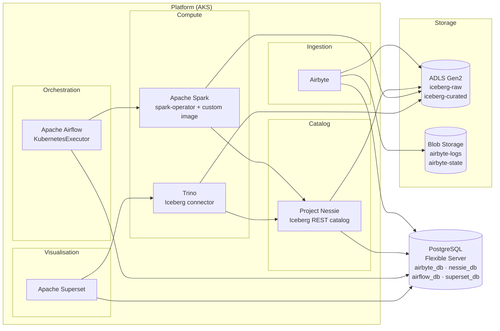

# Azure Data Lake

A fully open-source data lake on Azure, built on AKS. Ingestion via Airbyte,
table format via Apache Iceberg, catalog via Project Nessie, transformations
via Apache Spark, queries via Trino, orchestration via Airflow, and
visualisation via Superset — all running on Kubernetes with infrastructure
managed by Terraform.

---

## Architecture



---

## Stack

| Role | Technology |
|---|---|
| Ingestion | Airbyte |
| Table format | Apache Iceberg |
| Iceberg catalog | Project Nessie |
| Iceberg data storage | ADLS Gen2 |
| Service operational storage | Azure Blob Storage (GRS) |
| Transformations | Apache Spark (spark-operator, on-demand pods) |
| Query engine | Trino |
| Visualisation | Apache Superset |
| Orchestration | Apache Airflow |
| Database | Azure PostgreSQL Flexible Server (shared) |
| Cache/broker | Redis (bundled with Superset Helm chart) |
| Container platform | AKS |
| Container registry | Azure Container Registry (ACR) |
| Secrets | Azure Key Vault → Secrets Store CSI Driver |
| Infrastructure | Terraform |

---

## Repository layout

```
.
├── terraform/          # Azure infrastructure (see terraform/README.md)
│   └── bootstrap/      # One-time state backend setup
├── helm/               # Helm values + SecretProviderClass manifests (see helm/README.md)
├── docker/
│   └── spark/
│       └── Dockerfile  # Custom Spark image with Iceberg + Nessie + hadoop-azure JARs
├── scripts/
│   ├── dev-stop.sh     # Stop AKS + PostgreSQL to reduce idle costs
│   └── dev-start.sh    # Start them back up
└── .github/
    └── workflows/
        ├── ci.yml          # PR linting (Terraform, Helm, Dockerfile)
        ├── terraform.yml   # Plan + apply with manual approval
        ├── spark-image.yml # Build + push Spark image to ACR
        ├── helm-deploy.yml # Deploy Helm charts to AKS
        └── teardown.yml    # Stop dev environment (manual trigger)
```

---

## Getting started

### Prerequisites

- [Terraform](https://developer.hashicorp.com/terraform/install) >= 1.5
- [Azure CLI](https://learn.microsoft.com/en-us/cli/azure/install-azure-cli) — `az login`
- [kubectl](https://kubernetes.io/docs/tasks/tools/)
- [Helm](https://helm.sh/docs/intro/install/) >= 3.x
- Owner or Contributor + User Access Administrator on your Azure subscription

### 1 — Provision infrastructure

```bash
# Bootstrap the Terraform state backend (run once)
cd terraform/bootstrap
cp terraform.tfvars.example terraform.tfvars  # fill in real values
terraform init && terraform apply

# Initialise and apply the main config
cd ../
terraform init \
  -backend-config="resource_group_name=<rg>" \
  -backend-config="storage_account_name=<tfstate-account>"
cp terraform.tfvars.example terraform.tfvars  # fill in real values
terraform plan && terraform apply
```

See [terraform/README.md](terraform/README.md) for full variable reference and day-to-day operations.

### 2 — Add secrets to Key Vault

Several secrets must be added manually after `terraform apply`:

```bash
KV=<your-keyvault-name>
BLOB_ACCOUNT=<your-blob-storage-account-name>
RG=<your-resource-group>

# Airbyte blob storage connection string
BLOB_KEY=$(az storage account keys list \
  --account-name $BLOB_ACCOUNT --resource-group $RG \
  --query "[0].value" -o tsv)
az keyvault secret set --vault-name $KV --name blob-connection-string \
  --value "DefaultEndpointsProtocol=https;AccountName=${BLOB_ACCOUNT};AccountKey=${BLOB_KEY};EndpointSuffix=core.windows.net"

# Nessie JDBC URL
FQDN=$(cd terraform && terraform output -raw postgres_fqdn)
az keyvault secret set --vault-name $KV --name nessie-jdbc-url \
  --value "jdbc:postgresql://${FQDN}/nessie_db?sslmode=require"

# Superset secret key
az keyvault secret set --vault-name $KV --name superset-secret-key \
  --value $(python3 -c "import secrets; print(secrets.token_hex(32))")

# Airflow Fernet key
az keyvault secret set --vault-name $KV --name airflow-fernet-key \
  --value $(python3 -c "from cryptography.fernet import Fernet; print(Fernet.generate_key().decode())")
```

### 3 — Set up GitHub

1. Add all secrets listed in [.github/CLAUDE.md](.github/CLAUDE.md) to your repository
2. Go to **Settings → Environments** and create a `production` environment with a required reviewer — this gates Terraform apply and Helm deploys

### 4 — Build the Spark image

Push a change to `docker/spark/` or trigger `spark-image.yml` manually. The workflow builds and pushes the image to ACR and commits the image SHA to `docker/spark/.current-tag`.

### 5 — Deploy services

Trigger `helm-deploy.yml` manually or push a change to `helm/`. Services deploy in dependency order:

```
Nessie → Airbyte → Spark → Trino → Airflow → Superset
```

See [helm/README.md](helm/README.md) for manual deploy instructions and verification steps.

---

## CI/CD workflows

| Workflow | Trigger | Purpose |
|---|---|---|
| `ci.yml` | Pull request | Lint Terraform, Helm values, Dockerfile |
| `terraform.yml` | Push to `terraform/**` | Plan + apply (manual approval) |
| `spark-image.yml` | Push to `docker/spark/**` | Build + push image to ACR |
| `helm-deploy.yml` | Push to `helm/**` | Deploy all or single service |
| `teardown.yml` | Manual | Stop AKS + PostgreSQL to cut costs |

All workflows authenticate to Azure via OIDC — no stored credentials.

---

## Cost management

This environment is sized for development. Estimated idle cost: **~$80–90/month**.

To stop all billable compute when not in use:

```bash
export AKS_CLUSTER_NAME=<cluster>
export AKS_RESOURCE_GROUP=<rg>
export POSTGRES_SERVER_NAME=<postgres-server>

bash scripts/dev-stop.sh   # stop
bash scripts/dev-start.sh  # start back up
```

Or trigger the `teardown.yml` workflow from GitHub Actions.

> Azure automatically restarts a stopped PostgreSQL Flexible Server after 7 days.
> Run `dev-stop.sh` again if the environment has been idle that long.

---

## Secrets management

All credentials are stored in Azure Key Vault and injected into pods at startup
via the Secrets Store CSI Driver. Nothing sensitive is stored in this repository
or in Helm values files.

See [helm/README.md](helm/README.md) for the full secrets flow.
