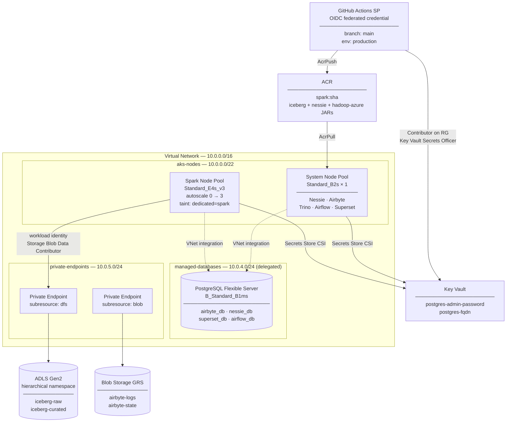

# Terraform — Azure Data Lake Infrastructure

Provisions the full Azure infrastructure for the data lake: networking, storage,
database, AKS, ACR, Key Vault, and IAM. A separate `bootstrap/` config seeds the
remote state backend before the main config can run.

---

## Infrastructure overview



| Resource | Purpose |
|---|---|
| ADLS Gen2 | Iceberg table data (`iceberg-raw`, `iceberg-curated`) |
| Blob Storage (GRS) | Airbyte logs and state (`airbyte-logs`, `airbyte-state`) |
| PostgreSQL Flexible Server | Shared DB for Airbyte, Nessie, Superset, Airflow |
| AKS — system pool | Platform services (Nessie, Airbyte, Trino, Superset, Airflow) |
| AKS — spark pool | Spark workers; autoscales 0–3, tainted `dedicated=spark:NoSchedule` |
| Key Vault | All generated secrets (postgres password, FQDNs) |
| ACR | Custom Spark image with Iceberg + Nessie + hadoop-azure JARs |

---

## Prerequisites

- [Terraform](https://developer.hashicorp.com/terraform/install) >= 1.5
- [Azure CLI](https://learn.microsoft.com/en-us/cli/azure/install-azure-cli) logged in: `az login`
- Sufficient Azure permissions: Owner or Contributor + User Access Administrator on the target subscription

---

## First-time setup

### Step 1 — Bootstrap (run once)

The remote state backend requires a storage account that must exist before
`terraform init` can run on the main config. Bootstrap creates it with no
remote backend of its own.

```bash
cd terraform/bootstrap
cp terraform.tfvars.example terraform.tfvars
# edit terraform.tfvars with real values
terraform init
terraform apply
```

Note the outputs — you will need `tfstate_storage_account_name` and
`resource_group_name` in the next step.

### Step 2 — Initialize the main config

Backend values cannot be stored in `terraform.tfvars`, so pass them explicitly:

```bash
cd terraform
terraform init \
  -backend-config="resource_group_name=<resource_group_name>" \
  -backend-config="storage_account_name=<tfstate_storage_account_name>"
```

### Step 3 — Configure variables

```bash
cp terraform.tfvars.example terraform.tfvars
# edit terraform.tfvars — see Variable reference below
```

Key values to set:
- `subscription_id` — `az account show --query id -o tsv`
- `api_server_authorized_ip_ranges` — your public IP (`curl ifconfig.me`) as `["x.x.x.x/32"]`
- GitHub Actions IP ranges can be added later; see `.github/CLAUDE.md`
- All storage/ACR/Key Vault names must be globally unique across Azure

### Step 4 — Plan and apply

```bash
terraform plan
terraform apply
```

First apply takes ~15–20 minutes (AKS is the slow resource).

### Step 5 — Post-apply

After apply, note these outputs for GitHub secrets setup:

```bash
terraform output github_actions_client_id   # → AZURE_CLIENT_ID
terraform output acr_login_server           # → ACR_LOGIN_SERVER
terraform output aks_kubeconfig             # → configure kubectl
```

---

## Day-to-day operations

### Stopping the environment (cost savings)

Stopping AKS and PostgreSQL reduces idle cost to ~$5/month (storage only).

```bash
# Stop AKS cluster (VMs stop billing; cluster config is preserved)
az aks stop \
  --name <aks_cluster_name> \
  --resource-group <resource_group_name>

# Stop PostgreSQL (note: Azure auto-restarts after 7 days)
az postgres flexible-server stop \
  --name <project>-postgres \
  --resource-group <resource_group_name>
```

### Starting the environment back up

```bash
az aks start \
  --name <aks_cluster_name> \
  --resource-group <resource_group_name>

az postgres flexible-server start \
  --name <project>-postgres \
  --resource-group <resource_group_name>
```

A `teardown.yml` GitHub Actions workflow (manual trigger) automates the stop
sequence — see `.github/CLAUDE.md`.

### Configuring kubectl

```bash
terraform output -raw aks_kubeconfig > ~/.kube/datalake-config
export KUBECONFIG=~/.kube/datalake-config
kubectl get nodes
```

---

## Full teardown

To destroy all resources and stop all billing:

```bash
terraform destroy
```

This does **not** destroy the bootstrap resources (storage account, resource group).
To remove those too:

```bash
cd terraform/bootstrap
terraform destroy
```

> After a full teardown you must re-run bootstrap and `terraform init` before
> the next apply.

---

## Variable reference

| Variable | Required | Default | Description |
|---|---|---|---|
| `subscription_id` | yes | — | Azure subscription ID |
| `location` | yes | — | Azure region (e.g. `eastus2`) |
| `resource_group_name` | yes | — | Resource group created by bootstrap |
| `project` | yes | — | Project name; used in resource names and tags |
| `environment` | yes | — | Environment tag (e.g. `production`, `dev`) |
| `adls_storage_account_name` | yes | — | Globally unique name for ADLS Gen2 account |
| `blob_storage_account_name` | yes | — | Globally unique name for Blob Storage account |
| `keyvault_name` | yes | — | Globally unique Key Vault name |
| `acr_name` | yes | — | Globally unique ACR name |
| `postgres_admin_username` | yes | — | PostgreSQL admin username (password is auto-generated) |
| `github_org` | yes | — | GitHub org/user that owns this repo |
| `github_repo` | yes | — | GitHub repository name |
| `api_server_authorized_ip_ranges` | yes | — | CIDRs allowed to reach the AKS API server |
| `aks_system_vm_size` | no | `Standard_B2s` | System node pool VM size |
| `aks_system_node_count` | no | `1` | System node pool fixed count |
| `aks_spark_vm_size` | no | `Standard_E4s_v3` | Spark node pool VM size |
| `aks_spark_min_count` | no | `0` | Spark pool minimum (0 = scale to zero) |
| `aks_spark_max_count` | no | `3` | Spark pool maximum |
| `aks_kubernetes_version` | no | `null` (latest) | Kubernetes version |
| `vnet_address_space` | no | `10.0.0.0/16` | VNet CIDR |

---

## Secrets management

All credentials are stored in Key Vault and surfaced into Kubernetes via the
Secrets Store CSI Driver — nothing is hardcoded in values files or environment
variables. The PostgreSQL admin password is auto-generated by Terraform on first
apply and never exposed as a Terraform output.

To retrieve the postgres password manually:

```bash
az keyvault secret show \
  --vault-name <keyvault_name> \
  --name postgres-admin-password \
  --query value -o tsv
```
